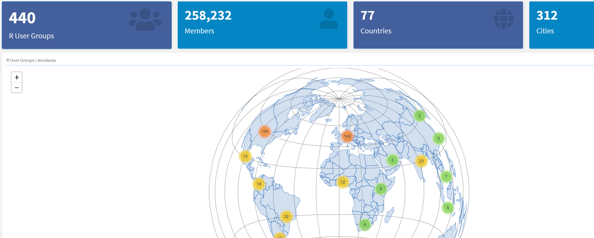

#  r-community.orgData-Driven Exploration of the R Community 

#  Includes pages from and added to Ben Ubah’s “R Community Explorer” during Google Summer of Code 2021- 	R Events with a calendar-	CRAN packages-	RStudio Community-	satRdays-	Twitter-	Stack Overflow-	R-Bloggers			           And more… 

---

---
#  Why r-community.org? 

#  1. Help users, new and experienced, connect with each other2. Show R language usage trends (think training programs)3. Motivate targeted assistance including where there are geographic disparities and common challenges3. Boost attendance of events such as workshops and R Meetups 

---
#  CalendarExploring R Events | by Groups that identify R as one of their topics of interest on Meetup.com 

#  Data Collected: June 28, 2021 

---
class: inverse
background-image: url('assets/img/image5.png')
background-size: cover

---
class: inverse
background-image: url('assets/img/image8.png')
background-size: cover

---
class: inverse
background-image: url('assets/img/image7.png')
background-size: cover

---
class: inverse
background-image: url('assets/img/image6.png')
background-size: cover

---
#  satRdaysFree R Conferences | Locally organized and not for profit 

#  Data Collected: June 28, 2021 

---
#  satRdaysFree R Conferences | Locally organized and not for profit 

#  Data Collected: June 28, 2021 

---
#  TwitterConnecting R users | June 2020 – June 2021 

#  Data Collected:June 28, 2021 

.pull-left[]

.pull-right[]

---
#  Data Collected: June 28, 2021 

.pull-left[]

.pull-right[]

---
#   GroupsExploring R User-groups | Groups that identify R as one of their topics of interest on Meetup.com 

#  Data Collected: June 28, 2021 

---
#   GroupsExploring R User-groups | Groups that identify R as one of their topics of interest on Meetup.com 

#  Data Collected: June 28, 2021 

---
#  Navigating r-community.org 

Clicking any entry on the left navigation bar will open a new dashboard screen
Button may not yet be active
Clicking arrows causes sorting
Scroll down for more content
CLICK and discover!

---
class: inverse
background-image: url('assets/img/image17.png')
background-size: cover

---
class: inverse
background-image: url('assets/img/image19.png')
background-size: cover

---
class: inverse
background-image: url('assets/img/image18.png')
background-size: cover

---

---
class: inverse
background-image: url('assets/img/image20.png')
background-size: cover

---
class: inverse
background-image: url('assets/img/image22.png')
background-size: cover

---
class: inverse
background-image: url('assets/img/image21.png')
background-size: cover

---
#  How r-community.org? 

---
class: inverse
background-image: url('assets/img/image23.png')
background-size: cover

---
class: inverse
background-image: url('assets/img/image25.png')
background-size: cover

---
class: inverse
background-image: url('assets/img/image24.png')
background-size: cover

---
#  How r-community.org? 

---
#    Sponsors 

---
#  Notes 

Issues are welcome: https://github.com/r-community/central/issues
User groups : If you do not see your group, please open an issue
R Calendar - if you do not find your meetup events listed, please open an issue
If you admin an org and want to add your events, consider becoming a sponsor
[https://github.com/r-community/central/issues](https://github.com/r-community/central/issues)

---
#    Thank you! 

A presentation by: Ben C. Ubah,  Rick Pack,
Meet Bhatnagar, João Vitor Cavalcante
A Central Website for R:
r-community.org
https://r-community.github.io/user-tweets/
.pull-left[]

.pull-right[]
